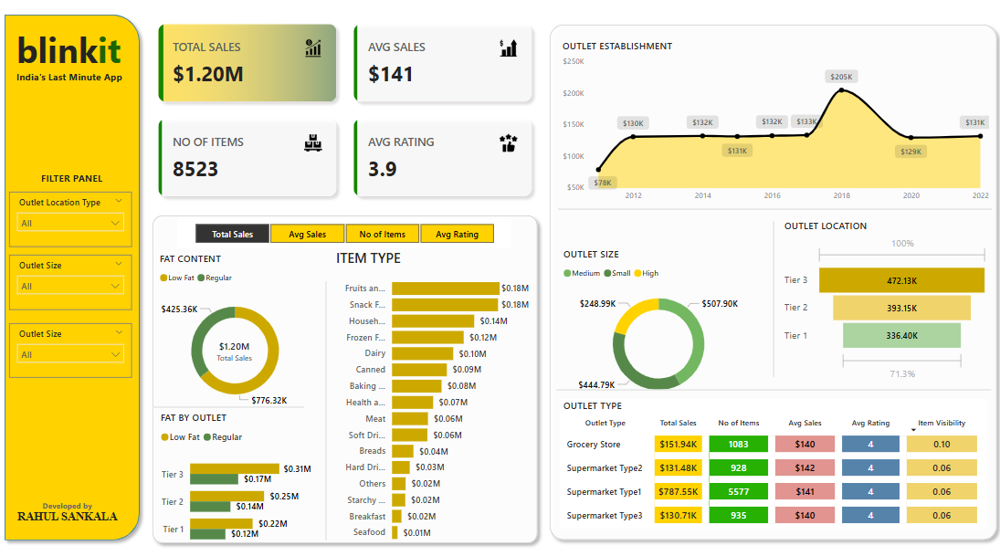

# Blinkit Sales Analysis 🚀  

## Overview  
This project analyzes sales data from Blinkit, a leading grocery delivery app. Using real-world data from a past freelance client, I performed data cleaning in **Excel** and **Power Query**, followed by data visualization in **Power BI**. The result is a **dynamic and insightful dashboard** that reveals key business metrics and trends.  

## Key Features  
✅ **Data Cleaning**: Handled missing values, standardized formats, and optimized dataset for analysis.  
✅ **Power Query**: Transformed and structured the data efficiently for seamless integration.  
✅ **Power BI Dashboard**: Created an interactive dashboard with KPIs such as total sales, average sales, outlet performance, and product category insights.  
✅ **Business Insights**: Analyzed sales performance across outlet types, item categories, and locations.  

## Tech Stack  
🔹 **Excel** – Data Cleaning  
🔹 **Power Query** – Data Transformation  
🔹 **Power BI** – Data Visualization  

## Dashboard Preview  
  

## Files in this Repository  
📂 **BlinkIT Grocery Data.xlsx** – Cleaned dataset used for analysis  
📂 **Blinkit Sales Analysis.pbix** – Power BI file with the final dashboard  

## How to Use  
1. Open **Blinkit Sales Analysis.pbix** in Power BI to explore the interactive dashboard.  
2. Refer to **BlinkIT Grocery Data.xlsx** for the cleaned dataset.  

## Insights & Learnings  
📊 **Tier 3 locations drive the highest sales, followed by Tier 2.**  
📊 **Supermarkets generate significantly higher revenue than grocery stores.**  
📊 **Regular fat-content products dominate sales compared to low-fat alternatives.**  

## Contact  
For any queries, feel free to reach out via [LinkedIn](https://www.linkedin.com/in/rahuls0723/) or check out my [GitHub profile](https://github.com/rahuls0723).  
